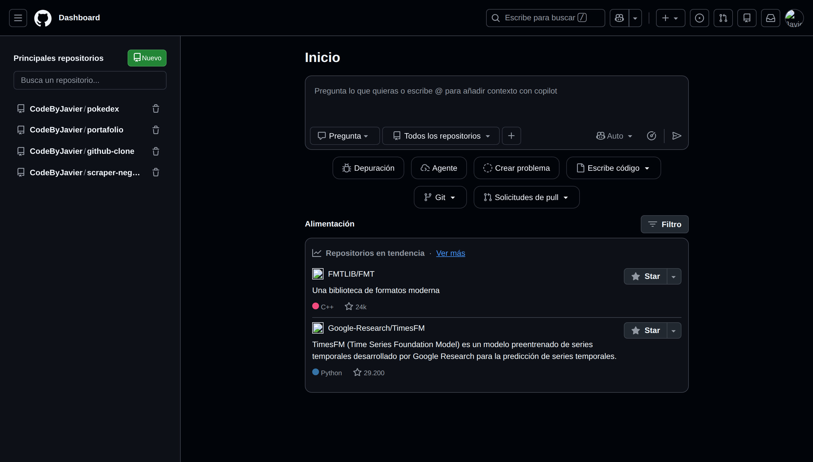

# Clon de la interfaz de GitHub

Clon de la página de inicio y de la página de creación de repositorios de
GitHub, construido con HTML, CSS y JavaScript. Sin frameworks, sin librerías,
sin proceso de compilación.



**[Ver la demo](https://codebyjavier.github.io/github-clone/)**

---

## Por qué existe este proyecto

Es un ejercicio de práctica, no un producto. El objetivo es reproducir una
interfaz real —con su maquetación responsive y su comportamiento— usando sólo
las tres tecnologías base, sin apoyarme en ningún framework.

Elegí la página de inicio de GitHub porque es de las más densas del sitio:
tiene barra superior con menús, cajón lateral, un compositor con varios
controles y un feed de contenido. Suficiente complejidad para que las
decisiones de estructura importen de verdad.

## Alcance

Un clon de una interfaz tan grande obliga a decidir qué funciona y qué no.
Estos son los tres grupos en los que clasifiqué cada elemento.

**Implementado y funcional**

- Maquetación completa y responsive de las dos páginas, con tres puntos de
  ruptura (1024px, 938px y 768px) y una versión de móvil con su propio menú
  lateral.
- Apertura y cierre del cajón lateral, del buscador superior y de los nueve
  menús desplegables, con cierre al pulsar fuera y sólo uno abierto a la vez.
- Filtro del feed mediante `<details>`, sin una línea de JavaScript.
- Interruptor de tema claro/oscuro que recuerda la elección y, mientras no
  elijas nada, sigue la preferencia de tu sistema operativo.
- Validación en vivo del nombre del repositorio: sanea los caracteres no
  permitidos mientras escribes, avisa si está en blanco o si excede los 100
  caracteres, y muestra cómo quedará el nombre final.
- Contador de caracteres de la descripción, con aviso al pasar de 350.

**Estado local (sin servidor)**

- Crear y borrar repositorios. Se guardan en `localStorage`, así que
  sobreviven a recargas y a cambiar de página.
- Los repositorios guardados se pintan en las cuatro listas de la interfaz
  (cajón lateral, barra superior, menú de móvil y vista de móvil), y
  borrar uno lo quita de las cuatro a la vez.
- Búsqueda y filtrado de esas listas, incluidos los repositorios creados
  desde la propia aplicación.

**Fuera de alcance**

Todo lo que exigiría un backend real: notificaciones, ajustes, autenticación,
creación efectiva de repositorios. Esos elementos están presentes en la
interfaz pero marcados como no interactivos, en vez de ser enlaces que no
llevan a ninguna parte.

## Stack

HTML, CSS y JavaScript. Sin frameworks, sin librerías, sin preprocesadores y
sin proceso de compilación.

Todo vanilla a propósito: cuando no hay una herramienta que resuelva las
cosas por ti, te toca entender por qué pasan. Buena parte de lo que aprendí
en este proyecto salió justo de ahí — de los fallos que un framework habría
tapado.

## Decisiones técnicas

**Fragmentos compartidos cargados con `fetch`.** La barra superior, el cajón
lateral, el menú de móvil y el pie viven una sola vez en `partials/`. Cada
página pone un `<div>` vacío como marcador y `load-partials.js` lo sustituye
por el HTML correspondiente. Así la barra superior se escribe una vez y no
una copia por página.

El precio de esa decisión: como usa `fetch`, el proyecto **necesita un
servidor**. Abrir `index.html` con doble clic no funciona (ver *Cómo
ejecutarlo*).

**El tema vive en un atributo, no en un `@media`.** El CSS no consulta la
preferencia del sistema: mira `data-theme` en el `<html>`. Quien decide el
valor de ese atributo es JavaScript, que al arrancar lee la elección guardada
y, si no hay ninguna, pregunta al sistema con `matchMedia`. Es lo que permite
que un botón pueda mandar sobre la preferencia del sistema operativo, que es
justo lo que se espera de un botón.

**Variables CSS agrupadas por función, no por color.** Se llaman
`--color-fg-muted` y no `--gris-claro`. Gracias a eso el tema claro son
treinta líneas que sólo redefinen valores, sin repetir una sola regla de
componente.

Y sólo son variables las que se lo ganan: las que cambian entre temas (que
tienen que serlo a la fuerza) y las que se repiten muchas veces. Lo que se
usaba dos o tres veces y siempre valía lo mismo está escrito directamente en
su regla.

**La escala tipográfica es la de GitHub.** Su base es de 14px, no los 16px
que trae el navegador por defecto, así que toda la escala va un escalón por
debajo de lo que uno escribiría por instinto.

**Un solo oyente para los botones que aún no existen.** Los repositorios se
pintan desde JavaScript, así que sus botones de borrar no existen cuando la
página arranca. En vez de enganchar un oyente a cada botón, hay uno solo en
`document` que, al recibir un clic, sube por el árbol con `closest()` para
averiguar si venía de una papelera y de cuál. Los elementos nuevos funcionan
sin registrar nada.

**Los paneles ocultos viven en el documento con `hidden`.** Cada botón que
abre un panel lo referencia con `aria-controls` y declara `aria-expanded`.
Así el estado de la interfaz es legible tanto para el CSS como para un lector
de pantalla, y JavaScript sólo tiene que alternar un atributo.

**Iconos en línea con `fill="currentColor"`.** Los SVG heredan el color del
texto que los rodea, así que el tema claro no necesita una segunda versión de
cada icono. Los decorativos llevan `aria-hidden="true"`; los que van solos
dentro de un botón se etiquetan en el botón.

## Cómo ejecutarlo

```bash
git clone https://github.com/CodeByJavier/github-clone.git
cd github-clone
python -m http.server 5500
```

Y abre `http://localhost:5500` en el navegador. No hay dependencias que
instalar.

**Hace falta el servidor.** Abriendo `index.html` con doble clic verás una
página en blanco: los fragmentos compartidos se cargan con `fetch`, y el
navegador bloquea esas peticiones bajo el protocolo `file://` por seguridad.
Cualquier servidor estático vale; `python -m http.server` está ahí porque no
pide instalar nada.

## Estructura del proyecto

```
.
├── index.html                # Página de inicio: compositor y feed
├── repo.html                 # Crear un repositorio nuevo
├── css/
│   ├── style-index.css       # Variables de tema, reinicio e interfaz común
│   └── style-repo.css        # Sólo lo propio del formulario de repo.html
├── js/
│   ├── load-partials.js      # Inserta los fragmentos y arranca la interfaz
│   ├── script-index.js       # Interfaz común, tema y repositorios guardados
│   └── create-repo.js        # Validación del formulario de repo.html
└── partials/
    ├── header.html           # Barra superior y sus menús
    ├── aside.html            # Cajón lateral de repositorios
    ├── toggle-menu.html      # Menú lateral de móvil
    └── footer.html
```

## Próximos pasos

- Mover a `localStorage` los repositorios que hoy están escritos a mano en los
  fragmentos, para tener una sola fuente de verdad y poder filtrar los datos
  en vez del DOM.
- Impedir que se creen dos repositorios con el mismo nombre.
- Repasar la navegación completa con teclado.
- Migrar los scripts a módulos ES, ahora que el proyecto ya necesita servidor
  de todas formas.

## Créditos y licencias

Los iconos son [Octicons](https://primer.style/octicons), el set de GitHub,
distribuido con licencia MIT. Están incrustados como SVG en línea dentro del
marcado, no como archivos sueltos.

## Aviso

Proyecto educativo sin ninguna relación con GitHub, Inc. Se reproduce su
interfaz únicamente como ejercicio de aprendizaje. Todas las marcas y
elementos de diseño pertenecen a sus respectivos propietarios.
